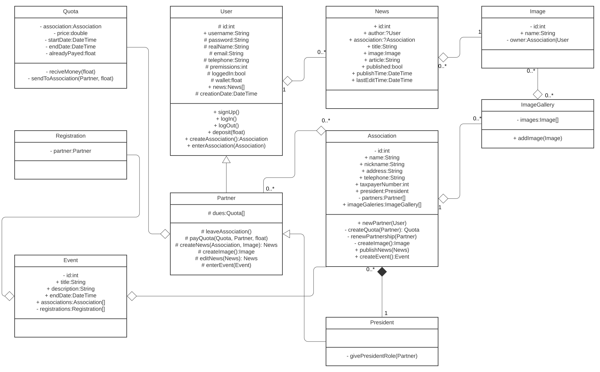

Criei o meu próprio diagrama de classes baseado no seu.

Em ./resources existe o ficheiro .sql para a criacao da BD.

Em ./config esta o ficheiro de config.

Commit para avaliar(ultimo antes de acabar prazo de entrega): 9700f01e96aaf63bb0ec6510747af07b5a6e8b83
